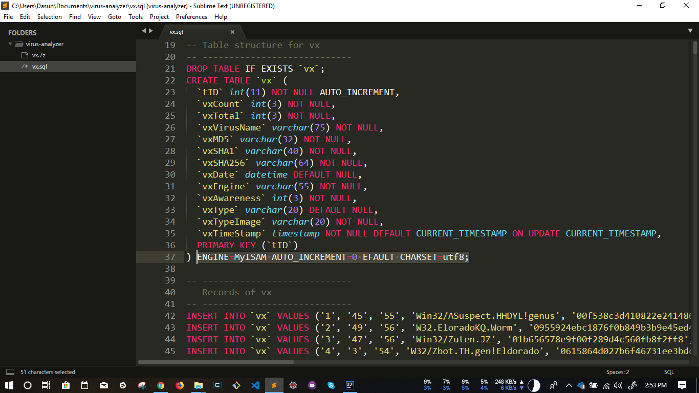

# Simple Virus Analyzer using Java and H2.

#### Notes

The `SQL` version of the database can be found from here.

The fully built `.jar` can be found from [here](https://drive.google.com/file/d/0B1g-HCHDlI3PSkpCOUE4bkpSSlk/view).

You need to migrate your SQL database to a H2 database using [Flyway](https://flywaydb.org/getstarted/firststeps/commandline). Since it weighs around 355MB it was decided not to include it into the repository.

However, when converting, you need to alter some lines of code in the original SQL file.

_Remove this line._

And remove all the `\'` and replace them with `.`

The converted file will look something like `xxxx.mv.db`. (Depending on your naming conventions) You'll need to rename it to `viruses.mv.db` or change the source code's DB URL to your database name.

### Usage

1. Clone the repository.
2. Adhere to *Notes* section.
3. Run the application. 

### Acknowledgements

1. [R3d3mp710nX](https://www.youtube.com/channel/UCgbXZgRyEdEBsIe-Ub5d08w) for the Virus DB.
2. [Apache Commons Library](https://mvnrepository.com/artifact/commons-codec/commons-codec/1.9)

